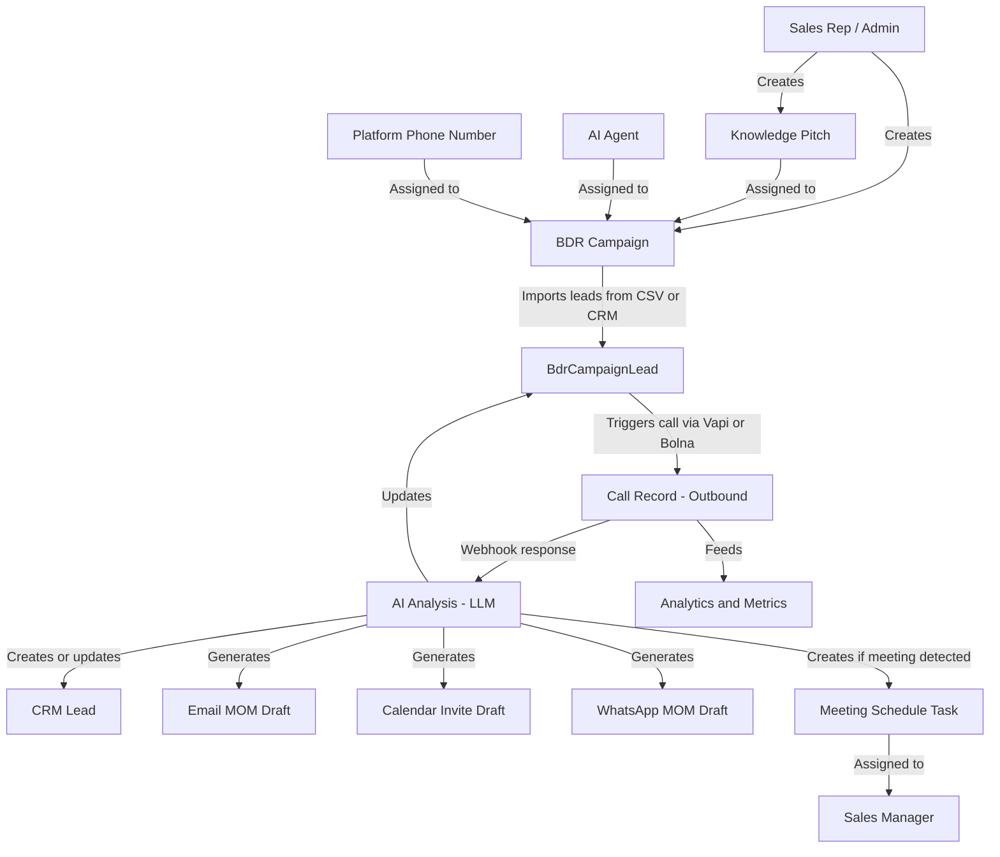
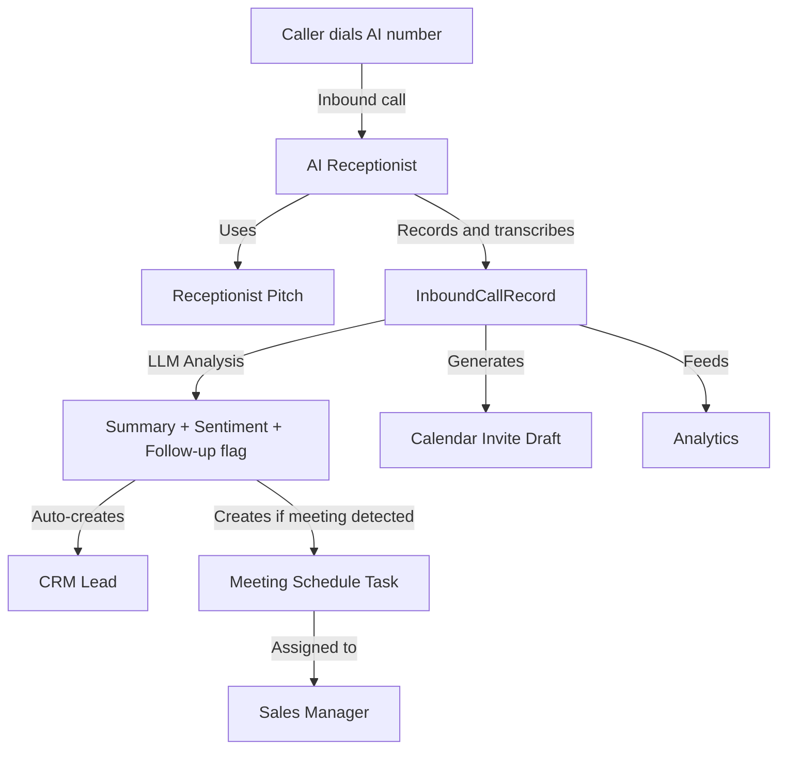
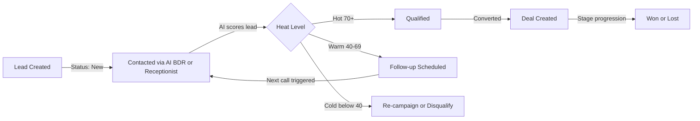
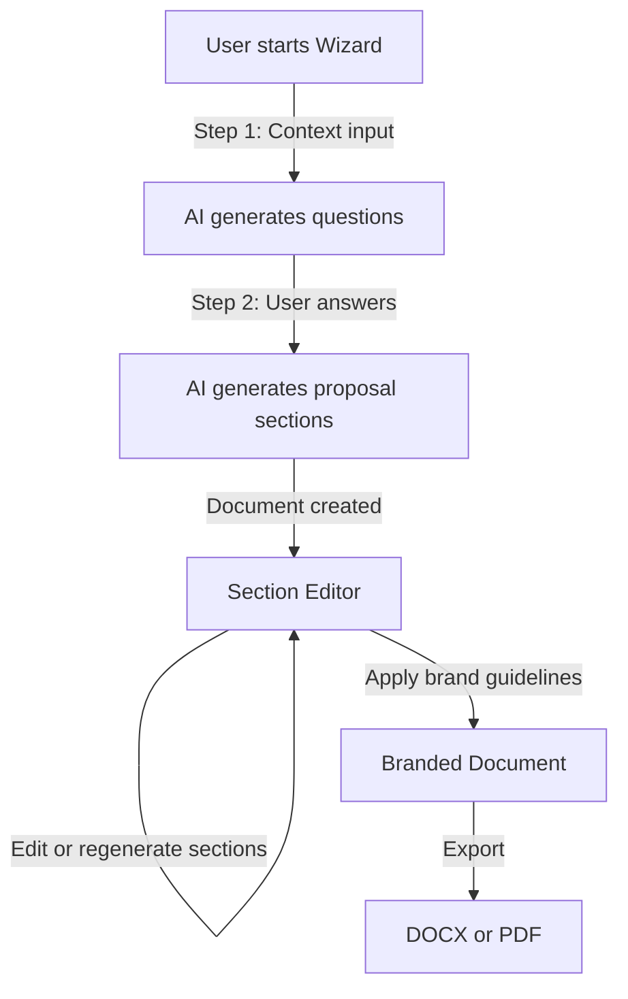

# Agentyne ASOC — Platform Features, Module Relationships & Mobile App Strategy

> **Purpose:** This document catalogues every feature in the platform, maps how modules integrate with each other, and recommends the optimal feature set for a mobile app targeting Sales Reps, Sales Managers, and CEOs.

---

## Table of Contents

1. [Platform Overview](#1-platform-overview)
2. [Module Catalogue & Features](#2-module-catalogue--features)
3. [Module Relationship Map (Flowchart Data)](#3-module-relationship-map-flowchart-data)
4. [Data Flow Diagrams](#4-data-flow-diagrams)
5. [Mobile App Feature Recommendations](#5-mobile-app-feature-recommendations)
6. [Mobile App Screen Map](#6-mobile-app-screen-map)
7. [Features Explicitly Excluded from Mobile App](#7-features-explicitly-excluded-from-mobile-app)
8. [Summary: Mobile App Priority Matrix](#8-summary-mobile-app-priority-matrix)

---

## 1. Platform Overview

Agentyne ASOC is a multi-tenant SaaS platform that combines AI-powered outbound/inbound calling, CRM, campaign management, proposal generation, and analytics into a single workspace. Each **Organization** is isolated; users within an org share data based on their RBAC role.

**Core Technology Stack:**
- Backend: Django (Python)
- Multi-tenancy: Organization model with RBAC roles
- AI Calling Engines: Vapi (USA/outbound) + Bolna (India/outbound)
- Enrichment: ContactOut, Apollo.io
- Communication: SMTP Email, WhatsApp, Calendar Invites
- Storage: GCP Vector Store, AWS S3
- Payments: Stripe + AppSumo

---

## 2. Module Catalogue & Features

### 2.1 Accounts & Authentication (`apps/accounts`)

| Feature | Description |
|---|---|
| Organization Management | Multi-tenant org creation, customer ID (AGT-XXXXXXXX), owner assignment |
| User Registration / Login | Email + password, email verification, mobile verification |
| User Profiles | Role, gender, country, mobile number, RBAC role assignment |
| Team Membership | Users can belong to multiple teams within an org |
| Invite System | Org admins invite users; role assigned on accept |
| Settings | Profile settings, password change, notification preferences |
| AppSumo Integration | Lifetime deal redemption and license management |
| Credit System | Per-org credit balance for AI calls and enrichment |
| SNS Notifications | AWS SNS-based notification service |

---

### 2.2 RBAC Roles (`apps/rbac_roles`)

| Role | Scope |
|---|---|
| Super Admin | Full platform access |
| Admin | Full org access |
| Sales Manager | Team-wide records, can override |
| Sales Rep | Own records only |
| Marketing Manager | Team-wide campaigns |
| Marketing Executive | Own campaigns |
| AI Agent Admin | AI agent configuration |
| Read-Only | View only |

**Modules controlled by RBAC:**
- Dashboard, Leads, Opportunities, AI Agents, Campaigns, Proposals, Settings

**Permission Actions:** Create, Read, Update, Delete, Override, Export, Import, Publish

---

### 2.3 CRM (`apps/crm`)

#### Leads
| Feature | Description |
|---|---|
| Lead CRUD | Create, view, edit, delete leads |
| Lead Status | New → Contacted → Qualified → Converted → Rejected / Disqualified |
| Heat Level | Hot / Warm / Cold (auto-computed by AI score) |
| AI Lead Score | 0–100 score based on engagement signals (calls, recency, completeness) |
| AI Sentiment | Positive / Neutral / Negative (from call analysis) |
| Lead Source | Track origin (AI BDR, AI Receptionist, manual, web form) |
| Lead Notes | Add/delete timestamped notes per lead |
| Lead Todos | Add/toggle/delete task items per lead |
| Lead Enrichment | Trigger ContactOut/Apollo enrichment from lead detail |
| Bulk Lead Create | API endpoint for bulk import |
| Bulk Campaign Attach | Attach multiple leads to a BDR campaign |
| Owner Assignment | Reassign lead owner within org |
| Quick Call | Trigger an AI call directly from lead detail |
| Data Sync | Lead ↔ Contact ↔ BdrCampaignLead auto-sync on save (by email) |
| AI BDR Link | FK to BdrCampaign, BdrCampaignLead, CallRecord |
| AI Receptionist Link | FK to AIReceptionist, InboundCallRecord |

#### Accounts (Companies)
| Feature | Description |
|---|---|
| Account CRUD | Create, view, edit, delete company accounts |
| Account Contacts | Add/edit/delete contacts within an account |
| Account Deals | Add/edit/delete deals within an account |
| Account Notes | Add/delete notes per account |
| Account Attachments | Upload files to an account |

#### Contacts
| Feature | Description |
|---|---|
| Contact CRUD | Create, view, edit, delete contacts |
| Contact Enrichment | Trigger enrichment per contact |
| AI Scoring | AI lead score, sentiment, call outcome |
| Data Sync | Contact ↔ Lead ↔ BdrCampaignLead auto-sync on save |

#### Deals / Opportunities
| Feature | Description |
|---|---|
| Deal CRUD | Create, view, edit, delete deals |
| Deal Stage | Pipeline stage with probability % |
| Deal Amount | Value + currency |
| Deal Owner | Assigned sales rep |
| Deal Dates | Creation, expected close, won date |
| Bulk Export | CSV / Excel export |
| Bulk Import | CSV import |
| Owner Reassignment | Change deal owner |

---

### 2.4 AI BDR / Dashboard (`apps/dashboard`)

#### Knowledge Pitches
| Feature | Description |
|---|---|
| Pitch CRUD | Create pitches from URL, PDF upload, or custom text |
| AI Description | Auto-generate pitch description via LLM |
| Context Inclusion | Include previous call context in new calls |
| Agent Voice Assignment | Assign a default voice to a pitch |
| Receptionist Pitches | Separate pitches for inbound AI Receptionist |

#### BDR Campaigns
| Feature | Description |
|---|---|
| Campaign CRUD | Create, view, edit, delete campaigns |
| Campaign Types | Outbound Call, Email Campaign, WhatsApp Campaign |
| Campaign Status | Ready → Live → Paused → Completed |
| Schedule | Start/end dates, selected days, preferred time windows per day |
| Lead Management | Import leads via CSV or from CRM |
| Lead Status Tracking | New → Contacted → Qualified → Converted → Rejected |
| Lead Tabs | New / Lead / Review / Info / Opportunity (LLM-classified) |
| Call Triggering | Trigger single call per lead |
| Campaign Toggle | Pause/resume campaign |
| Export Leads | CSV / XLSX export of campaign leads |
| Transfer Numbers | Configure call transfer numbers + prompt |
| Email Config | Attach email template to campaign |
| WhatsApp Config | Attach WhatsApp config to campaign |

#### Call Records
| Feature | Description |
|---|---|
| Call Log | Full call history per lead |
| Call Status | Scheduled → Queued → Ringing → In Progress → Completed / Failed |
| Recording | Audio recording URL (S3 / GCP) |
| Transcript | Full call transcript text |
| AI Summary | LLM-generated call summary |
| Sentiment Analysis | Positive / Neutral / Negative |
| Talk Ratio | Agent vs. caller speaking time % |
| Call Outcome | LLM-extracted outcome |
| Call-to-Actions | Up to 3 extracted action items |
| Follow-up Date | Suggested follow-up date |
| Email MOM | Minutes of meeting email draft |
| Calendar Invite MOM | Calendar invite draft with subject + body |
| WhatsApp MOM | WhatsApp message draft |
| Proposed Meeting Time | LLM-parsed meeting datetime from transcript |
| Live Call Monitoring | Listen to live calls in real-time |
| Force Stop | Admin can force-stop a live call |

#### AI Agents
| Feature | Description |
|---|---|
| Agent CRUD | Create, update, delete AI agents |
| Voice Selection | Choose voice provider + voice ID |
| Model Selection | Choose LLM model + provider |
| Call Type | Inbound or Outbound |
| Engine Selection | Vapi (USA) or Bolna (India) |
| System Message | Custom agent persona/instructions |
| Transfer Prompt | Prompt for call transfer scenarios |
| Phone Number Assignment | Assign platform phone numbers to org |
| Voices for Number | Filter compatible voices by phone number engine |

#### Prospect Pulse
| Feature | Description |
|---|---|
| Pulse CRUD | Create monitoring pulses from PDF, URL, or text |
| Frequency | Weekly, Monthly, or Custom interval |
| Keyword Extraction | Auto-extract top keywords from content |
| Feed Monitoring | Monitor news/content feeds related to pulse |
| Feed Toggle | Enable/disable individual feed items |
| Feed Update | Edit feed item content |
| Status Toggle | Activate/deactivate a pulse |

#### Metrics & Analytics
| Feature | Description |
|---|---|
| BDR Dashboard | Overview of campaigns, calls, leads |
| Sales Dashboard | Sales-focused KPI view |
| Analytics Page | Aggregate analytics across campaigns |
| Metrics Page | Detailed call metrics |
| Recent Calls | Partial view of recent call activity |
| Live Calls | Real-time active call monitoring |
| Export Calls | Export call data |
| Email Preview/Send | Preview and send dashboard summary emails |

#### Communication Settings
| Feature | Description |
|---|---|
| Email Template Config | Create/manage email templates with LLM prompts |
| SMTP Server Settings | Configure SMTP credentials + OTP verification |
| Calendar Invite Settings | Configure calendar invite templates |
| WhatsApp Settings | Configure WhatsApp API credentials |

---

### 2.5 AI Receptionist (`apps/ai_receptionist`)

| Feature | Description |
|---|---|
| Receptionist Config | Create AI receptionist with pitch (URL/PDF/text) |
| Inbound Call Handling | Receive and handle inbound calls via AI |
| Call Recording | Record inbound calls |
| Transcription | Transcribe inbound calls |
| AI Summary | LLM-generated summary of inbound call |
| Sentiment Analysis | Sentiment of inbound call |
| Talk Ratio | Agent vs. caller speaking time |
| Follow-up Flag | Mark calls needing follow-up |
| Calendar Invite Draft | Auto-generate calendar invite from transcript |
| Proposed Meeting Time | Parse meeting time from transcript |
| CRM Lead Creation | Auto-create CRM lead from inbound call |

---

### 2.6 Scheduling (`apps/scheduling`)

| Feature | Description |
|---|---|
| Meeting Schedule Tasks | Auto-created when call transcript indicates meeting needed |
| Task Assignment | Assign to Sales Manager by default |
| Task Status | Pending → In Progress → Calendar Sent → Done |
| Overdue Detection | Flag tasks where proposed time has passed |
| Inbound + Outbound | Triggered by both AI BDR and AI Receptionist calls |

---

### 2.7 Proposal Builder (`apps/proposals`)

| Feature | Description |
|---|---|
| Document List | View all proposals |
| Wizard (Multi-step) | Guided intake: start → steps → generate |
| AI Question Generation | LLM generates intake questions based on context |
| Document Editor | Rich section-by-section editor |
| Section Save | Save individual sections |
| Section Regenerate | Re-generate a section with AI |
| Section Reorder | Drag-and-drop section ordering |
| Save All Sections | Bulk save all sections |
| Export DOCX | Export proposal as Word document |
| Export PDF | Export proposal as PDF |
| Brand Guidelines | Create/manage brand profiles (colors, fonts, logos) |
| Brand Preview | Preview brand styling |
| Proposal Settings | Configure default proposal settings |
| Autosave | Auto-save document changes |
| Image Generation | AI-generated images for proposals |
| Job Status Polling | Poll async generation job status |

---

### 2.8 Enrichment (`apps/enrichment`)

| Feature | Description |
|---|---|
| Email Search | Find email by name/company |
| Person Search | Enrich person profile |
| Company Search | Enrich company data |
| LinkedIn Enrichment | Pull LinkedIn profile data |
| Bulk Enrichment | Enrich multiple leads at once |
| Credit Tracking | Track credits used per enrichment request |
| Provider Support | ContactOut, Apollo.io |
| Response Caching | Store enriched data per lead/contact |

---

### 2.9 Mass Mail (`apps/massmail`)

| Feature | Description |
|---|---|
| Email Campaigns | Send bulk emails to contact lists |
| Contact Lists | Manage email contact lists |
| Email Templates | HTML email templates |
| Send Tracking | Track sent/received emails |

---

### 2.10 Payment & Licensing (`apps/payment`)

| Feature | Description |
|---|---|
| Stripe Integration | Subscription and one-time payments |
| AppSumo Integration | Lifetime deal redemption |
| Offline Payments | Manual payment recording |
| Credit System | Credits for AI calls and enrichment |
| Plan Management | Free, paid plan tiers |
| License Management | License validity tracking |
| Billing Cycles | Monthly/annual billing |

---

### 2.11 Note Taker *(Planned Future Module)*

> **Status:** Not yet built — planned for a future release. Designed as a first-class mobile feature from day one.

| Feature | Description |
|---|---|
| Meeting Notes | Capture structured notes during or after a meeting |
| Voice-to-Text Notes | Dictate notes hands-free on mobile |
| Note Linking | Link notes to a Lead, Deal, Account, or Meeting Task |
| AI Note Summary | LLM summarises raw notes into key points and action items |
| Action Item Extraction | Auto-extract follow-up tasks from notes |
| Note History | Full timestamped note history per record |
| Shared Notes | Share notes with team members |
| Offline Support | Capture notes without connectivity, sync when online |

---

### 2.12 Opportunity Intelligence *(Planned Future Module)*

> **Status:** Planned — reads across all historical data to generate contextual intelligence per opportunity/deal. Persona-aware output.

| Feature | Description |
|---|---|
| Pre-Meeting Briefing | For Sales Rep: AI-generated prep card before a meeting — contact history, past call summaries, deal stage, open todos, enriched profile |
| Opportunity Timeline | Full chronological history of all activity on a deal: calls, notes, emails, status changes, AI agent interactions |
| AI Agent Activity Log | Shows what the AI BDR and AI Receptionist did on this opportunity — calls made, outcomes, sentiments |
| Team Activity Feed | For Manager: what each rep has done on the opportunity — notes added, calls made, status changes |
| Manager Insights | Summary of team activity, rep engagement level, risk flags, next recommended action |
| CEO Opportunity View | High-level deal health: stage, value, days in stage, AI activity volume, team engagement score |
| Risk Flags | AI-detected signals: no activity in X days, negative sentiment trend, stalled stage |
| Recommended Next Action | LLM-suggested next step based on full opportunity history |
| Cross-Opportunity Insights | CEO view: patterns across all deals — which stages stall most, which reps close fastest |

---

### 2.13 Slide Builder (`slide_builder_v2`)

| Feature | Description |
|---|---|
| Deck Creation | Create presentation decks |
| AI Outline Generation | LLM-generated slide outlines |
| Slide Editor | Edit individual slides |
| Template Picker | Choose from slide templates |
| Palette Customizer | Customize color palettes |
| Brand Settings | Apply brand guidelines to decks |
| Present Mode | Full-screen presentation mode |
| PPTX Export | Export as PowerPoint file |
| Image Drop Zone | Add images to slides |

---

## 3. Module Relationship Map (Flowchart Data)

The following describes every integration link between modules. Use this to build a flowchart.

### 3.1 Node List (Modules)

```
[Accounts & Auth]
[RBAC Roles]
[CRM - Leads]
[CRM - Accounts]
[CRM - Contacts]
[CRM - Deals]
[AI BDR Campaigns]
[Knowledge Pitches]
[Call Records - Outbound]
[AI Agents]
[Platform Phone Numbers]
[AI Receptionist]
[Call Records - Inbound]
[Scheduling - Meeting Tasks]
[Prospect Pulse]
[Enrichment]
[Note Taker - Planned]
[Opportunity Intelligence - Planned]
[Proposal Builder]
[Slide Builder]
[Mass Mail]
[Email / WhatsApp / Calendar]
[Analytics & Metrics]
[Payment & Credits]
```

### 3.2 Edge List (Relationships)

```
[Accounts & Auth] --belongs to--> [RBAC Roles]
[Accounts & Auth] --owns--> [CRM - Leads]
[Accounts & Auth] --owns--> [AI BDR Campaigns]
[Accounts & Auth] --owns--> [AI Receptionist]
[Accounts & Auth] --owns--> [Proposal Builder]
[Accounts & Auth] --owns--> [Knowledge Pitches]
[Accounts & Auth] --owns--> [Prospect Pulse]

[RBAC Roles] --controls access to--> [CRM - Leads]
[RBAC Roles] --controls access to--> [AI BDR Campaigns]
[RBAC Roles] --controls access to--> [Proposal Builder]
[RBAC Roles] --controls access to--> [Analytics & Metrics]

[Payment & Credits] --gates usage of--> [AI BDR Campaigns]
[Payment & Credits] --gates usage of--> [Enrichment]
[Payment & Credits] --gates usage of--> [AI Receptionist]

[Knowledge Pitches] --used by--> [AI BDR Campaigns]
[Knowledge Pitches] --used by--> [AI Receptionist]

[AI Agents] --assigned to--> [AI BDR Campaigns]
[Platform Phone Numbers] --assigned to--> [AI BDR Campaigns]
[Platform Phone Numbers] --determines engine for--> [AI Agents]

[AI BDR Campaigns] --contains--> [CRM - Leads]
[AI BDR Campaigns] --generates--> [Call Records - Outbound]
[AI BDR Campaigns] --creates/updates--> [CRM - Leads]

[Call Records - Outbound] --triggers--> [Email / WhatsApp / Calendar]
[Call Records - Outbound] --triggers--> [Scheduling - Meeting Tasks]
[Call Records - Outbound] --updates--> [CRM - Leads]
[Call Records - Outbound] --feeds--> [Analytics & Metrics]

[AI Receptionist] --generates--> [Call Records - Inbound]
[Call Records - Inbound] --creates--> [CRM - Leads]
[Call Records - Inbound] --triggers--> [Scheduling - Meeting Tasks]
[Call Records - Inbound] --triggers--> [Email / WhatsApp / Calendar]

[Scheduling - Meeting Tasks] --assigned to--> [Accounts & Auth]
[Scheduling - Meeting Tasks] --linked to--> [Call Records - Outbound]
[Scheduling - Meeting Tasks] --linked to--> [Call Records - Inbound]

[CRM - Leads] --converts to--> [CRM - Deals]
[CRM - Leads] --belongs to--> [CRM - Accounts]
[CRM - Leads] --syncs with--> [CRM - Contacts]
[CRM - Leads] --enriched by--> [Enrichment]
[CRM - Leads] --linked to--> [Call Records - Outbound]
[CRM - Leads] --linked to--> [Call Records - Inbound]

[CRM - Contacts] --belongs to--> [CRM - Accounts]
[CRM - Contacts] --enriched by--> [Enrichment]
[CRM - Contacts] --syncs with--> [CRM - Leads]

[CRM - Accounts] --has many--> [CRM - Contacts]
[CRM - Accounts] --has many--> [CRM - Deals]

[CRM - Deals] --owned by--> [Accounts & Auth]
[CRM - Deals] --linked to--> [CRM - Leads]
[CRM - Deals] --feeds--> [Analytics & Metrics]

[Enrichment] --enriches--> [CRM - Leads]
[Enrichment] --enriches--> [CRM - Contacts]
[Enrichment] --consumes--> [Payment & Credits]

[Prospect Pulse] --monitors--> [External Content/News]
[Prospect Pulse] --generates--> [Prospect Pulse Feeds]

[Note Taker - Planned] --linked to--> [CRM - Leads]
[Note Taker - Planned] --linked to--> [CRM - Deals]
[Note Taker - Planned] --linked to--> [Scheduling - Meeting Tasks]
[Note Taker - Planned] --feeds--> [Opportunity Intelligence - Planned]

[Opportunity Intelligence - Planned] --reads--> [CRM - Deals]
[Opportunity Intelligence - Planned] --reads--> [CRM - Leads]
[Opportunity Intelligence - Planned] --reads--> [Call Records - Outbound]
[Opportunity Intelligence - Planned] --reads--> [Call Records - Inbound]
[Opportunity Intelligence - Planned] --reads--> [Note Taker - Planned]
[Opportunity Intelligence - Planned] --reads--> [Scheduling - Meeting Tasks]
[Opportunity Intelligence - Planned] --reads--> [Enrichment]
[Opportunity Intelligence - Planned] --generates insights for--> [Accounts & Auth]

[Proposal Builder] --exports to--> [DOCX / PDF]
[Proposal Builder] --uses--> [Brand Guidelines]

[Slide Builder] --exports to--> [PPTX]
[Slide Builder] --uses--> [Brand Settings]

[Analytics & Metrics] --aggregates--> [Call Records - Outbound]
[Analytics & Metrics] --aggregates--> [Call Records - Inbound]
[Analytics & Metrics] --aggregates--> [CRM - Deals]
[Analytics & Metrics] --aggregates--> [AI BDR Campaigns]
```

---

## 4. Data Flow Diagrams

### 4.1 Outbound AI Call Flow



### 4.2 Inbound AI Receptionist Flow



### 4.3 Lead Lifecycle Flow



### 4.4 Proposal Builder Flow



---

## 5. Mobile App Feature Recommendations

### Philosophy
The mobile app should be a **field companion** — not a full desktop replacement. It should surface the most time-sensitive, action-oriented information that each persona needs while away from their desk.

---

### 5.1 Sales Rep — Mobile Features

**Primary need:** Know who to call next, log activity quickly, see their pipeline, walk into every meeting prepared.

| Priority | Feature | Why |
|---|---|---|
| 🔴 Critical | My Leads (filtered to own) | Core daily work — see assigned leads, heat level, status |
| 🔴 Critical | Lead Detail View | View contact info, AI score, last call summary, notes |
| 🔴 Critical | Add Lead Note | Quick note after a meeting or call |
| 🔴 Critical | Update Lead Status | Mark lead as contacted, qualified, etc. |
| 🔴 Critical | My Todos | See and tick off lead-level todos |
| 🔴 Critical | Call History per Lead | See past call recordings, summaries, outcomes |
| 🔴 Critical | Note Taker | Capture meeting notes on the go, linked to lead or deal; AI extracts action items |
| 🔴 Critical | Opportunity Intelligence — Pre-Meeting Briefing | AI-generated prep card before a meeting: contact history, past calls, deal stage, open todos, enriched profile |
| 🟠 High | Quick Call Trigger | Trigger an AI call to a lead from mobile |
| 🟠 High | My Deals / Opportunities | See own pipeline deals and stages |
| 🟠 High | Opportunity Timeline | Full activity history on a deal — calls, notes, AI actions, status changes |
| 🟠 High | Meeting Schedule Tasks | See pending meeting tasks assigned to me |
| 🟠 High | Lead Enrichment Trigger | Enrich a lead on the go — get LinkedIn, email, company data instantly |
| 🟠 High | Notifications | Push alerts for follow-up reminders, new leads assigned |
| 🟡 Medium | Campaign Lead Status | See status of leads in my campaigns |
| 🟡 Medium | Email MOM View | Read AI-generated email draft from a call |

**Screens for Sales Rep:**
- Home (My Activity Feed)
- My Leads List
- Lead Detail + Notes + Todos + Enrich
- My Deals / Pipeline
- Opportunity Detail (Timeline + Pre-Meeting Briefing)
- Note Taker (quick capture)
- My Calls (recent call records)
- Meeting Tasks
- Notifications

---

### 5.2 Sales Manager — Mobile Features

**Primary need:** Monitor team performance, reassign work, approve/action meeting tasks, understand what has happened on every opportunity including AI agent activity.

| Priority | Feature | Why |
|---|---|---|
| 🔴 Critical | Team Dashboard | KPIs: calls made, leads contacted, deals in pipeline, conversion rate |
| 🔴 Critical | All Team Leads | View leads across the team, filter by rep/status/heat |
| 🔴 Critical | Meeting Schedule Tasks | Review and action pending meeting tasks (their primary queue) |
| 🔴 Critical | Lead Owner Reassignment | Reassign leads between reps from mobile |
| 🔴 Critical | Deal Pipeline View | See all team deals by stage and value |
| 🔴 Critical | Opportunity Intelligence — Manager Insights | Per-deal summary of team activity: what each rep did, AI agent calls made, outcomes, sentiment trend, risk flags, recommended next action |
| 🔴 Critical | Note Taker | Add manager-level notes to deals and leads; review rep notes |
| 🟠 High | Campaign Status | See which campaigns are live/paused and their progress |
| 🟠 High | Call Records Review | Listen to call recordings, read transcripts and summaries |
| 🟠 High | AI Agent Activity Log | See what the AI BDR and AI Receptionist did on each opportunity |
| 🟠 High | Follow-up Alerts | Push notifications for overdue follow-ups and meeting tasks |
| 🟠 High | Rep Performance Summary | Calls per rep, conversion rates, lead scores |
| 🟠 High | Lead Enrichment View | See enriched data on leads to assess quality |
| 🟡 Medium | Approve/Reassign Meeting Tasks | Change task status or reassign to another rep |
| 🟡 Medium | Lead Status Override | Override lead status across team records |
| 🟡 Medium | Campaign Toggle | Pause/resume a campaign from mobile |

**Screens for Sales Manager:**
- Home (Team Dashboard with KPIs)
- Team Leads (filterable by rep, status, heat)
- Meeting Tasks Queue
- Deal Pipeline (Kanban or list)
- Opportunity Detail (Team Activity + AI Agent Log + Manager Insights)
- Note Taker (add/review notes)
- Campaign Monitor
- Call Review (recordings + transcripts)
- Rep Performance Cards
- Notifications

---

### 5.3 CEO — Mobile Features

**Primary need:** High-level business health, revenue pipeline, AI system performance, and a wide-angle view of opportunity health and team activity — without operational detail.

| Priority | Feature | Why |
|---|---|---|
| 🔴 Critical | Executive Dashboard | Total pipeline value, deals won/lost, revenue forecast |
| 🔴 Critical | Campaign Performance Summary | Calls made, connection rate, qualified leads per campaign |
| 🔴 Critical | Deal Pipeline Overview | Total deals by stage, total value, win rate |
| 🔴 Critical | AI Call Volume & Outcomes | Total calls, avg duration, sentiment breakdown, conversion % |
| 🔴 Critical | Opportunity Intelligence — CEO View | Cross-opportunity insights: deal health scores, days in stage, AI activity volume, team engagement, risk flags, stall patterns |
| 🟠 High | Lead Funnel Metrics | New → Contacted → Qualified → Converted funnel |
| 🟠 High | Top Performing Reps | Leaderboard of reps by deals closed / leads qualified |
| 🟠 High | Revenue Metrics | MRR/ARR indicators, deals closing this month |
| 🟠 High | Note Taker | Capture strategic notes linked to deals or campaigns; visible to managers |
| 🟡 Medium | Cross-Opportunity Patterns | Which stages stall most, which reps close fastest, AI vs human conversion comparison |
| 🟡 Medium | Prospect Pulse Feeds | High-level market intelligence from monitored sources |
| 🟡 Medium | Credit & Usage Summary | AI call credits consumed, enrichment usage |
| 🟡 Medium | Proposal Activity | Proposals created, sent, in progress |

**Screens for CEO:**
- Home (Executive Summary Card)
- Pipeline Overview (deal stages + value)
- Opportunity Intelligence (deal health + cross-opportunity patterns)
- Campaign Performance
- AI Activity (calls, sentiment, outcomes)
- Lead Funnel Chart
- Team Leaderboard
- Note Taker (strategic notes)
- Market Intelligence (Prospect Pulse)

---

## 6. Mobile App Screen Map

```mermaid
flowchart TD
    Login -->|Sales Rep| SR[Sales Rep Home]
    Login -->|Sales Manager| SM[Manager Home]
    Login -->|CEO| CEO[CEO Executive Home]

    SR --> SR1[My Leads]
    SR --> SR2[My Deals]
    SR --> SR3[My Calls]
    SR --> SR4[Meeting Tasks]
    SR --> SR5[Note Taker]
    SR --> SR6[Notifications]

    SR1 --> SR1a[Lead Detail]
    SR1a --> SR1b[Add Note / Note Taker]
    SR1a --> SR1c[Update Status]
    SR1a --> SR1d[Trigger AI Call]
    SR1a --> SR1e[View Call History]
    SR1a --> SR1f[Enrich Lead]

    SR2 --> SR2a[Opportunity Detail]
    SR2a --> SR2b[Pre-Meeting Briefing]
    SR2a --> SR2c[Opportunity Timeline]
    SR2a --> SR2d[Add Note]

    SM --> SM1[Team Leads]
    SM --> SM2[Meeting Tasks Queue]
    SM --> SM3[Deal Pipeline]
    SM --> SM4[Campaign Monitor]
    SM --> SM5[Call Review]
    SM --> SM6[Rep Performance]
    SM --> SM7[Note Taker]

    SM1 --> SM1a[Lead Detail + Reassign]
    SM2 --> SM2a[Task Detail + Action]
    SM3 --> SM3a[Opportunity Detail]
    SM3a --> SM3b[Manager Insights]
    SM3a --> SM3c[AI Agent Activity Log]
    SM3a --> SM3d[Team Activity Feed]

    CEO --> CEO1[Pipeline Overview]
    CEO --> CEO2[Opportunity Intelligence]
    CEO --> CEO3[Campaign Performance]
    CEO --> CEO4[AI Activity Summary]
    CEO --> CEO5[Lead Funnel]
    CEO --> CEO6[Team Leaderboard]
    CEO --> CEO7[Market Intelligence]
    CEO --> CEO8[Note Taker]

    CEO2 --> CEO2a[Deal Health Cards]
    CEO2 --> CEO2b[Cross-Opportunity Patterns]
    CEO2 --> CEO2c[Risk Flags]
```



---

## 7. Features Explicitly Excluded from Mobile App

The following features are desktop-only due to complexity, setup nature, or infrequent use:

| Feature | Reason to Exclude |
|---|---|
| Proposal Builder (full editor) | Complex rich-text editing, not mobile-friendly |
| Slide Builder | Presentation creation requires large screen |
| AI Agent Configuration | One-time setup, admin task |
| SMTP / WhatsApp Settings | Infrastructure config, not field work |
| Knowledge Pitch Creation | Content creation task, desktop-appropriate |
| BDR Campaign Creation | Complex scheduling + CSV upload |
| Enrichment Bulk Operations | Batch processing, desktop task — single-lead enrichment IS included |
| Mass Mail Campaign Setup | Template editing, desktop task |
| RBAC Role Management | Admin-only, infrequent |
| Vector Store Operations | Technical/admin task |
| Payment & Billing | Sensitive, desktop-appropriate |

---

## 8. Summary: Mobile App Priority Matrix

| Feature Group | Sales Rep | Manager | CEO |
|---|---|---|---|
| My Leads + Lead Detail | ✅ Critical | ✅ High | ❌ |
| Lead Notes + Todos | ✅ Critical | ✅ Medium | ❌ |
| **Lead Enrichment** | ✅ High | ✅ High | ❌ |
| Quick AI Call Trigger | ✅ High | ✅ Medium | ❌ |
| Call History + Recordings | ✅ Critical | ✅ High | ❌ |
| Meeting Schedule Tasks | ✅ High | ✅ Critical | ❌ |
| Deal Pipeline | ✅ High | ✅ Critical | ✅ Critical |
| **Note Taker** | ✅ Critical | ✅ Critical | ✅ High |
| **Opportunity Intelligence — Pre-Meeting Briefing** | ✅ Critical | ❌ | ❌ |
| **Opportunity Intelligence — Manager Insights + AI Agent Log** | ❌ | ✅ Critical | ❌ |
| **Opportunity Intelligence — CEO Wide View + Patterns** | ❌ | ❌ | ✅ Critical |
| Opportunity Timeline | ✅ High | ✅ High | ❌ |
| Team Performance KPIs | ❌ | ✅ Critical | ✅ Critical |
| Campaign Status | ✅ Medium | ✅ High | ✅ High |
| Lead Funnel Metrics | ❌ | ✅ High | ✅ Critical |
| AI Call Volume + Outcomes | ❌ | ✅ High | ✅ Critical |
| AI Agent Activity Log | ❌ | ✅ High | ✅ Medium |
| Revenue / Win Rate | ❌ | ✅ Medium | ✅ Critical |
| Cross-Opportunity Patterns | ❌ | ❌ | ✅ High |
| Rep Leaderboard | ❌ | ✅ High | ✅ High |
| Prospect Pulse Feeds | ❌ | ❌ | ✅ Medium |
| Push Notifications | ✅ Critical | ✅ Critical | ✅ High |

---

*Document generated: April 2026 | Agentyne ASOC Platform Analysis*
